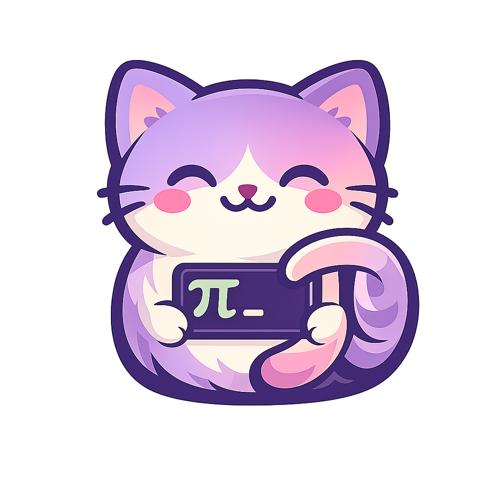
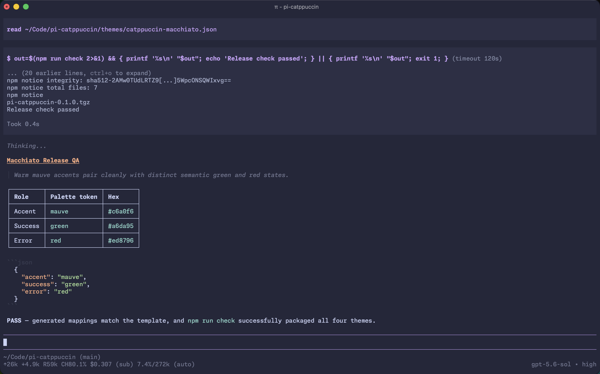

<div align="center">
<h1>Pi Catppuccin</h1>
  
  <p>
    <strong>An unofficial Catppuccin theme for Pi. ☕</strong>
  </p>
  <p>
    <a href="https://www.npmjs.com/package/pi-catppuccin"></a>
    <a href="https://www.npmjs.com/package/pi-catppuccin"></a>
    <a href="https://github.com/madeleineostoja/pi-catppuccin/issues"></a>
    <a href="LICENSE"></a>
  </p>
</div>

Catppuccin's four flavours for the [Pi](https://pi.dev) agent harness, adapted with a focus on a calm, muted experience.

<p align="center">
  
</p>

## 🛠️ Usage

Install the package from npm:

```sh
pi install npm:pi-catppuccin
```

Open `/settings` in Pi and choose your favourite flavour. That's it — save and enjoy!

| Flavour      | Theme                  | Mood                                               |
| ------------ | ---------------------- | -------------------------------------------------- |
| 🌻 Latte     | `catppuccin-latte`     | Light, bright, and tuned for comfortable contrast. |
| 🪴 Frappé    | `catppuccin-frappe`    | Soft and muted.                                    |
| 🌺 Macchiato | `catppuccin-macchiato` | Rich, balanced, and suited to everyday use.        |
| 🌿 Mocha     | `catppuccin-mocha`     | The deepest and coziest of the bunch.              |

Want Pi to follow your terminal's light and dark appearance? Pair two flavours in `~/.pi/agent/settings.json`:

```json
{
  "theme": "catppuccin-latte/catppuccin-macchiato"
}
```

Pi will use Latte for light terminals and Macchiato for dark ones.

### Trying it locally

You can take the themes for a spin without changing your settings:

```sh
pi -e /absolute/path/to/pi-catppuccin
```

### Updating or removing

```sh
pi update npm:pi-catppuccin
pi remove npm:pi-catppuccin
```

## ✨ About

This port keeps Pi calm and readable while still feeling unmistakably Catppuccin:

- **Mauve at heart.** All four flavours use mauve as their accent rather than shipping every flavour/accent combination.
- **Quiet chrome.** Surface and Overlay colors keep borders and everyday UI out of the way.
- **Clear states.** Semantic colors are saved for warnings, errors, diffs, and other meaningful moments.
- **A gentle thinking gradient.** Pi's thinking border moves from neutral surfaces toward mauve as reasoning increases.
- **Readable Latte.** Text-facing accents are slightly darkened where the stock palette would be too faint on a light background.

Most colors come directly from the official Catppuccin palette. Whiskers derives only the raised panels, error tint, thinking gradient, and Latte readability adjustments.

## 🧑‍💻 Development

[`catppuccin.tera`](catppuccin.tera) is the source of truth. The JSON themes are generated and committed so Pi can install this repository directly — please don't edit them by hand.

```sh
nix shell nixpkgs#catppuccin-whiskers --command whiskers catppuccin.tera
nix shell nixpkgs#catppuccin-whiskers --command whiskers catppuccin.tera --check
npm run check
```

Automated checks keep generated files in sync and smoke-test the package. A visual check is still worthwhile, especially with Latte and Macchiato.

## 💝 Thanks

- [Catppuccin](https://github.com/catppuccin/catppuccin) for the palette
- [Whiskers](https://github.com/catppuccin/whiskers) for generation
- [Pi](https://github.com/earendil-works/pi) for the theme and package system
- [otahontas/pi-coding-agent-catppuccin](https://github.com/otahontas/pi-coding-agent-catppuccin) and [scarcekoi/pi](https://github.com/scarcekoi/pi) for visual and tooling inspiration

Released under the [MIT License](LICENSE).

&nbsp;

<p align="center">
  
</p>
